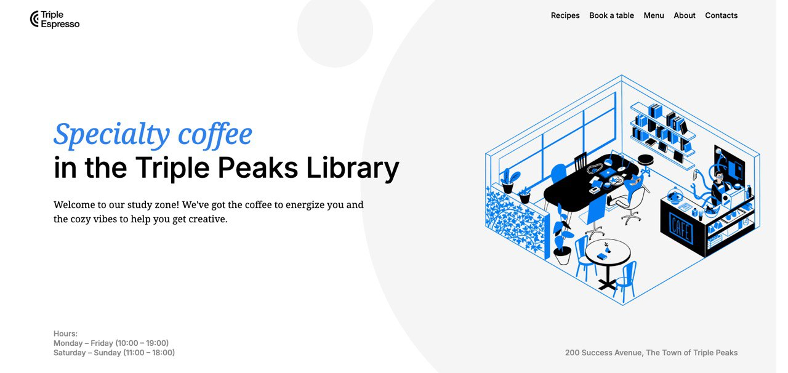

# Oleg's Coffee Shop Webpage

## Project Name

Oleg's Coffee Shop Webpage

## Project Description

Oleg's Coffee Shop Webpage is a simple, elegant site designed to showcase a local coffee shop's offerings and provide an easy way for customers to book a table. The webpage includes several sections such as recipes, table reservations, menu, and contact information.

**Functionality:**

- **Recipes Section**: Displays embedded YouTube videos with coffee brewing recipes.
- **Reservation Form**: Allows users to book a table by providing their name, number of guests, date and time, and email address.
- **Menu Section**: (Currently empty, to be filled with menu items).
- **Contacts Section**: (Currently empty, to be filled with contact details).

**Technologies Used:**

- HTML: For the structure of the webpage.
- CSS: For styling the webpage.
- JavaScript: (Not currently implemented, but can be used for form validation, interactivity, etc.).
- Google Fonts: For custom typography.

## Plans for Improving the Project

While working on this project, several ideas for future improvements have come up. These include:

1. **Enhanced Styling**:

   - Add more sophisticated styling to make the webpage more visually appealing. For example, using CSS animations, hover effects, and transitions to enhance user experience.
   - Implement responsive design to ensure the site looks great on all devices, from mobile phones to large desktop screens.

2. **Interactive Menu Section**:

   - Populate the menu section with actual menu items, including images, descriptions, and prices.
   - Implement filtering and search functionality to help users find their favorite items quickly.

3. **Advanced Form Validation**:

   - Implement JavaScript validation for the reservation form to provide immediate feedback to users when they enter invalid data.
   - Integrate form validation with server-side scripts to handle reservations more securely and efficiently.

4. **Contact Section**:

   - Add a contact form with fields for name, email, subject, and message, allowing users to easily get in touch with the coffee shop.
   - Include a map showing the coffee shop's location and a link to get directions.

5. **User Authentication**:

   - Implement user authentication to allow users to create accounts, log in, and manage their reservations.
   - Provide users with the ability to view and edit their reservation history.

6. **Accessibility Improvements**:
   - Ensure the website is accessible to all users, including those with disabilities. This includes adding ARIA labels, ensuring sufficient color contrast, and making the site navigable by keyboard.

By implementing these improvements, the website will not only look better and be more functional but also provide a more user-friendly experience for all visitors.

## How to Run the Project

1. Clone the repository to your local machine.
2. Open `index.html` in your preferred web browser.
3. (Optional) Use a local server for better performance and to handle potential CORS issues with external resources.

## Author

Oleg Luzenin

Feel free to contribute to the project by forking the repository, making improvements, and submitting pull requests. Your feedback and suggestions are always welcome!
